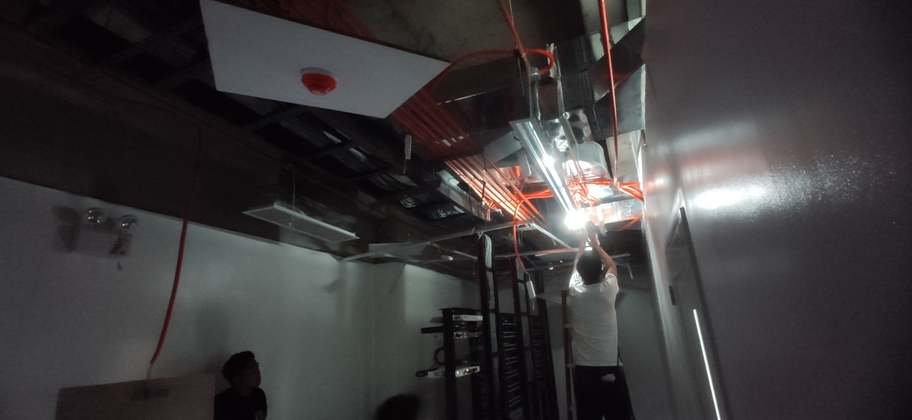

# WEEKLY REPORT 37

**Weekly Progress Report**

**Project/Task Details:**
- **Project Name:** SWAK BPO RELOCATION AND INSTALLATION

**Completion:**
- 78%

**Key Accomplishments:**

- CONTINOUS RELOCATION, INSTALLATION AND LIGHT TEST 
- 2ND FLOOR

- 3RD FLOOR

- 4TH FLOOR

- SUBMITTED PROGRESS BILLING FOR 62%
- waiting for feedback

**Project/Task Details:**
- **Project Name:** HANN TEMFACIL
**Completion:**
- 0%
**Key Accomplishments:**
- WAITING FOR PO
- REVISED QUOTATION TO P2,194,207.93

**Project/Task Details:**
- **Project Name:** Aeropark 717 COFFEE SHOP
**Completion:**
- 0%
**Key Accomplishments:**
- SITE SURVEY
- quotation submitted

**Project/Task Details:**
- **Project Name:** OFFICE CLARK 10
**Completion:**
- 0%
**Key Accomplishments:**
- Negotiated Price 

**Project/Task Details:**
- **Project Name:** ALVIERA AVIDA
**STATUS:**
- CANCELLED

**Project/Task Details:**
- **Project Name:** SWAK BPO 5TH FLOOR
**STATUS:**
- PENDING

**Project/Task Details:**
- **Project Name:** SWAK BPO CHANGE ORDER (2ND,3RD AND 4TH)
**STATUS:**
- PENDING

**Project/Task Details:**
- **Project Name:** WEST GO CHIEFT DUCTED TYPE ACU
**STATUS:**
- PENDING

**Project/Task Details:**
- **Project Name:** Philredco Towers
**Completion:**
- 60%
**Key Accomplishments:**
- Preparing proposal
---
